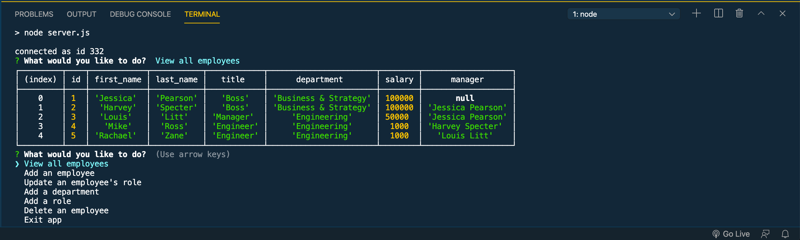
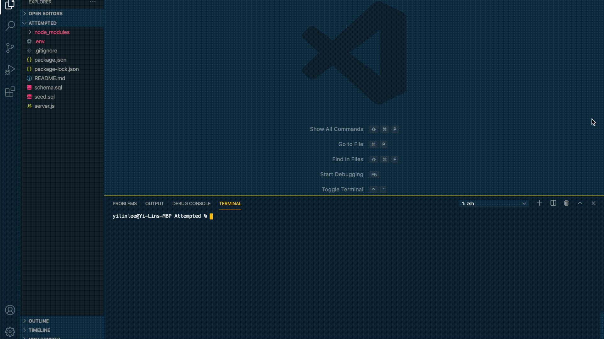

# Employee-Tracker
[](https://opensource.org/licenses/MIT)

## Table of Contents
- [Description](#description)
- [Installation](#installation)
- [Usage](#usage)
- [License](#license)
- [Contributing](#contributing)

## Description
A command line application that allows the user to easily manage a company's employee details.
The user will be able to track an employee's role, department, manager, and salary.
The functions currently available include adding an employee to the system with their details,
adding roles, adding departments, updating an employee's role, viewing all the employees, and deleting employees.

## Installation
Clone or download the package and open terminal in the package directory. Run the schema.sql file in MySQL to set up the database. The seed.sql file is optional to run in MySQL for some sample inputs. Then run the following command in terminal to install all the dependencies into the local node_modules folder:

```
npm i
```

## Usage
After installation, you can then run the following command to run the application:

```
npm start
```

When viewing all the employees in the system, the application will look like this:


Using the application will look like:
[](./assets/application-demo.gif)

## License
Licensed under the MIT License.

## Contributing
To contribute directly to the code base, please see this [How to Contribute](https://github.com/Microsoft/vscode/wiki/How-to-Contribute) document.


